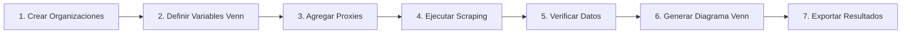

# 🚧 Work in Progress - Asistente de Recopilación y Análisis de Datos de Organizaciones de la Sociedad Civil Lideradas por Mujeres en Colombia

> **⚠️ NOTA**: Este proyecto está en desarrollo activo. La documentación y funcionalidades pueden cambiar.

Sistema multi-agente para la gestión, scraping y visualización de datos de organizaciones de la sociedad civil lideradas por mujeres constructoras de paz en Colombia.

## 🎯 Enfoque

Este sistema está diseñado específicamente para:
- **Organizaciones de la sociedad civil** lideradas por mujeres
- **Construcción de paz** y reconciliación
- **Empoderamiento femenino** y liderazgo
- **Análisis de datos** con diagramas Venn

## 📋 Características

- **Backend**: FastAPI con SQLAlchemy async, Pydantic y Alembic
- **Sistema Multi-Agente**: LangGraph con GPT-4o para orquestación inteligente
- **Scraper**: Búsqueda web automatizada con Tavily API
- **Gestión desde Chat**: Crear organizaciones, variables Venn y más desde lenguaje natural
- **Base de datos**: PostgreSQL
- **Frontend**: Vue.js 3 con OpenLayers (mapas), D3 (diagramas de Venn) y Plotly
- **Contenerización**: Docker Compose con todos los servicios
- **Trazabilidad**: LangSmith para monitoreo de agentes

## 🖥️ Páginas del Frontend

| Ruta | Página | Descripción |
|------|--------|-------------|
| `/` | Inicio | Dashboard con estadísticas de organizaciones |
| `/chat` | Chat IA | Asistente inteligente para búsqueda y gestión |
| `/organization-management` | Gestión | Vista y edición de organizaciones |
| `/venn-variables` | Variables Venn | Definir variables y proxies (también desde chat) |
| `/venn` | Diagrama Venn | Visualización de diagramas de Venn |
| `/scraping` | Lanzador Scraping | Configurar y ejecutar scraping con progreso |
| `/data-results` | Resultados | Ver y verificar datos scrapeados |
| `/map` | Mapa | Visualización geográfica de organizaciones |

## 🤖 Sistema Multi-Agente

El sistema utiliza **8 agentes especializados** orquestados por LangGraph:

| Agente | Modelo | Función |
|--------|--------|---------|
| 🛡️ Guardrails | GPT-4o-mini | Valida que las consultas estén en tema |
| 🎯 Orquestador | GPT-4o | Coordina el flujo entre agentes |
| 🔍 Scraper | GPT-4o-mini + Tavily | Busca información en la web |
| 📊 Clasificador | GPT-4o | Estructura y normaliza datos |
| ✅ Evaluador | GPT-4o | Valida calidad de datos |
| 🗃️ **DB Query** | GPT-4o-mini | Consulta organizaciones en la base de datos |
| 📈 **Venn Agent** | GPT-4o-mini | Gestiona variables Venn desde el chat |
| 📝 Finalizador | GPT-4o-mini | Genera respuesta amigable |

## 🏗️ Estructura del Proyecto

```
ProyectoFinal/
├── backend/
│   ├── app/
│   │   ├── agents/        # 🤖 Sistema multi-agente LangGraph
│   │   │   ├── graph.py         # Definición del grafo
│   │   │   ├── guardrails.py    # Validación de consultas
│   │   │   ├── orchestrator.py  # Coordinador de agentes
│   │   │   ├── scraper.py       # Búsqueda web
│   │   │   ├── classifier.py    # Clasificación de datos
│   │   │   ├── evaluator.py     # Evaluación de calidad
│   │   │   ├── db_agent.py      # 🆕 Orquestador modular de BD
│   │   │   ├── db_common.py     # 🆕 Utilidades compartidas y embeddings
│   │   │   ├── db_organizations.py  # 🆕 CRUD de organizaciones
│   │   │   ├── db_venn_variables.py # 🆕 CRUD de variables Venn
│   │   │   ├── db_venn_intersections.py # 🆕 Intersecciones con expresiones anidadas
│   │   │   ├── venn_agent.py    # Gestión de variables Venn
│   │   │   └── finalizer.py     # Generación de respuestas
│   │   ├── api/           # Endpoints API
│   │   ├── db/            # Configuración de base de datos
│   │   ├── models/        # Modelos SQLAlchemy
│   │   ├── services/      # Servicios (scraper)
│   │   └── ml/            # Módulos de Machine Learning
│   ├── alembic/           # Migraciones
│   ├── scripts/           # Scripts de utilidad
│   ├── Dockerfile
│   └── requirements.txt
├── worker/
│   ├── Dockerfile
│   └── worker.py          # Celery worker
├── frontend/
│   ├── src/
│   │   ├── views/         # Componentes de vista
│   │   ├── api.js         # Cliente API
│   │   └── App.vue
│   ├── Dockerfile
│   └── package.json
├── infra/
│   └── docker-compose.yml
├── scripts/
├── .env.example
├── Makefile
└── README.md
```

## 🚀 Inicio Rápido

### Prerrequisitos

- Docker y Docker Compose
- Git

### Instalación

1. **Clonar el repositorio**
```bash
git clone <repository-url>
cd ProyectoFinal
```

2. **Configurar variables de entorno**
```bash
cp .env.example .env
# Editar .env si es necesario
```

3. **Levantar los servicios**
```bash
# Usando Make
make up

# O directamente con Docker Compose
cd infra && docker-compose up -d --build
```

4. **Ejecutar migraciones de base de datos**
```bash
make migrate
```

5. **Cargar datos de ejemplo (seed)**
```bash
make seed
```

### Acceso a la aplicación

- **Frontend**: http://localhost:5173
- **API Backend**: http://localhost:8000
- **API Docs (Swagger)**: http://localhost:8000/docs
- **API Docs (ReDoc)**: http://localhost:8000/redoc

## 📦 Comandos Make

```bash
# Construir e iniciar todos los servicios
make up

# Detener todos los servicios
make down

# Ver logs
make logs

# Ejecutar migraciones
make migrate

# Cargar datos de ejemplo
make seed

# Ejecutar scraping para una organización
make run-scrape ID=1

# Ejecutar scraping para todas las organizaciones
make run-scrape-all

# Limpiar volúmenes y datos
make clean

# Ejecutar tests
make test

# Ejecutar linting
make lint
```

## 🔧 API Endpoints

### Chat con IA (Principal)

| Método | Endpoint | Descripción |
|--------|----------|-------------|
| POST | `/api/chat` | Enviar mensaje al asistente IA |
| GET | `/api/chat/history/{session_id}` | Obtener historial de chat |

### Organizaciones

| Método | Endpoint | Descripción |
|--------|----------|-------------|
| GET | `/api/organizations` | Listar organizaciones |
| GET | `/api/organizations/{id}` | Detalle de organización |
| PUT | `/api/organizations/{id}` | Actualizar organización |
| DELETE | `/api/organizations/{id}` | Eliminar organización |

### Gestión de Organizaciones y Links

| Método | Endpoint | Descripción |
|--------|----------|-------------|
| GET | `/api/organizations/full` | Listar organizaciones con links |
| PUT | `/api/organizations/{id}` | Actualizar organización con links |
| DELETE | `/api/organizations/{id}` | Eliminar organización y sus links |
| GET | `/api/organizations/{id}/links` | Listar links de organización |
| POST | `/api/organizations/{id}/links` | Añadir link a organización |
| DELETE | `/api/organizations/links/{id}` | Eliminar link |

### Validaciones Pendientes

| Método | Endpoint | Descripción |
|--------|----------|-------------|
| GET | `/api/validations` | Listar validaciones pendientes |
| POST | `/api/validations/{id}/decide` | Aprobar/rechazar validación |

### Fuentes de Información

| Método | Endpoint | Descripción |
|--------|----------|-------------|
| GET | `/api/info-sources` | Listar fuentes de información |
| POST | `/api/info-sources` | Crear fuente |
| PUT | `/api/info-sources/{id}` | Actualizar fuente |
| DELETE | `/api/info-sources/{id}` | Eliminar fuente |

### Variables Venn y Proxies

| Método | Endpoint | Descripción |
|--------|----------|-------------|
| GET | `/api/venn-variables` | Listar variables con proxies |
| POST | `/api/venn-variables` | Crear variable |
| PUT | `/api/venn-variables/{id}` | Actualizar variable |
| DELETE | `/api/venn-variables/{id}` | Eliminar variable |
| POST | `/api/venn-variables/{id}/proxies` | Añadir proxy a variable |
| PUT | `/api/venn-variables/proxies/{id}` | Actualizar proxy |
| DELETE | `/api/venn-variables/proxies/{id}` | Eliminar proxy |

### Intersecciones Venn (Expresiones Lógicas)

| Método | Endpoint | Descripción |
|--------|----------|-------------|
| GET | `/api/venn/intersections` | Listar intersecciones configuradas |
| POST | `/api/venn/intersections` | Crear intersección con expresión lógica |
| PUT | `/api/venn/intersections/{id}` | Actualizar intersección |
| DELETE | `/api/venn/intersections/{id}` | Eliminar intersección |
| POST | `/api/venn/intersections/{id}/calculate` | Calcular resultado para organizaciones |

### Configuración de Scraping

| Método | Endpoint | Descripción |
|--------|----------|-------------|
| GET | `/api/scraping/configs` | Listar configuraciones |
| POST | `/api/scraping/configs` | Crear configuración |
| DELETE | `/api/scraping/configs/{id}` | Eliminar configuración |

### Sesiones de Scraping

| Método | Endpoint | Descripción |
|--------|----------|-------------|
| GET | `/api/scraping/sessions` | Listar sesiones |
| GET | `/api/scraping/sessions/{id}` | Detalle de sesión |
| POST | `/api/scraping/sessions/launch` | Lanzar nueva sesión |
| POST | `/api/scraping/sessions/{id}/cancel` | Cancelar sesión |
| WS | `/api/scraping/ws/progress/{id}` | WebSocket progreso tiempo real |

### Datos Scrapeados

| Método | Endpoint | Descripción |
|--------|----------|-------------|
| GET | `/api/scraping/data` | Listar datos (con filtros) |
| GET | `/api/scraping/data/summary` | Resumen estadístico |
| GET | `/api/scraping/data/{id}` | Detalle de dato |
| PUT | `/api/scraping/data/{id}` | Actualizar dato |
| DELETE | `/api/scraping/data/{id}` | Eliminar dato |
| POST | `/api/scraping/data/{id}/verify` | Verificar/desverificar dato |

### Variables (Legacy)

| Método | Endpoint | Descripción |
|--------|----------|-------------|
| GET | `/api/organizations/{id}/variables` | Listar variables |
| POST | `/api/variables` | Guardar variable |
| PATCH | `/api/variables/{id}/verify` | Verificar variable |
| GET | `/api/variables/keys` | Obtener claves únicas |

### Diagrama de Venn

| Método | Endpoint | Descripción |
|--------|----------|-------------|
| GET | `/api/venn/data?vars=key1,key2` | Datos para Venn |
| GET | `/api/venn/available-keys` | Claves disponibles |

### Mapa

| Método | Endpoint | Descripción |
|--------|----------|-------------|
| GET | `/api/map/locations` | Ubicaciones GeoJSON |
| GET | `/api/map/organizations` | Organizaciones para mapa |

## 🕷️ Ejecutar Scraping

### Scraping individual
```bash
# Usando Make
make run-scrape ID=1

# O directamente con Docker
docker exec proyecto_ia_backend python -m app.services.scraper 1
```

### Scraping masivo
```bash
# Usando Make
make run-scrape-all

# O directamente con Docker
docker exec proyecto_ia_backend python -m app.services.scraper --all
```

### Via API
```bash
# Una organización
curl -X POST http://localhost:8000/api/scrape \
  -H "Content-Type: application/json" \
  -d '{"organization_id": 1}'

# Todas las organizaciones
curl -X POST http://localhost:8000/api/scrape \
  -H "Content-Type: application/json" \
  -d '{"all_organizations": true}'
```

## 📊 Visualizaciones

### Diagrama de Venn
1. Navegar a `/venn` en el frontend
2. Seleccionar 2-5 variables para comparar
3. Clic en "Generar Diagrama"
4. Exportar como SVG o PDF

### Mapa
1. Navegar a `/map` en el frontend
2. Seleccionar tipo de visualización (marcadores o coroplético)
3. Para coroplético, seleccionar variable para colorear

## 🧪 Tests

```bash
# Ejecutar tests del backend
make test

# O directamente
docker exec proyecto_ia_backend pytest
```

## 🔍 Linting

```bash
# Ejecutar linting
make lint

# O directamente
docker exec proyecto_ia_backend flake8 app/
docker exec proyecto_ia_backend black --check app/
```

## 📝 Migraciones con Alembic

```bash
# Crear nueva migración
docker exec proyecto_ia_backend alembic revision --autogenerate -m "descripcion"

# Aplicar migraciones
docker exec proyecto_ia_backend alembic upgrade head

# Revertir última migración
docker exec proyecto_ia_backend alembic downgrade -1
```

## 🐛 Troubleshooting

### Los servicios no inician
```bash
# Ver logs de todos los servicios
make logs

# O logs de un servicio específico
docker logs proyecto_ia_backend
```

### Error de conexión a la base de datos
```bash
# Verificar que PostgreSQL está corriendo
docker exec proyecto_ia_db pg_isready

# Reiniciar servicios
make down && make up
```

### Error de Playwright/Scraper
```bash
# Reinstalar browsers de Playwright
docker exec proyecto_ia_backend playwright install chromium
```

---

## 📚 Guía Completa de Uso

Esta sección contiene ejemplos detallados en lenguaje natural para usar todas las funcionalidades del sistema.

### 🚀 Inicio Rápido - Flujo Completo

```bash
# 1. Levantar el sistema
cd infra && docker-compose up -d --build

# 2. Esperar a que los servicios estén listos (30 segundos aprox)
sleep 30

# 3. Verificar que todo funciona
curl http://localhost:8000/api/organizations

# 4. Abrir el frontend en el navegador
# http://localhost:5173
```

### 💬 Ejemplos de Chat con IA

Navega a **http://localhost:5173/chat** y usa estos ejemplos:

#### 🔍 Búsqueda de Organizaciones

| Lo que escribes | Lo que hace el sistema |
|-----------------|------------------------|
| `Busca organizaciones de mujeres en Chocó` | Busca en web y muestra resultados |
| `¿Qué colectivos de mujeres constructoras de paz hay en Antioquia?` | Búsqueda filtrada por tema y región |
| `Información sobre organizaciones de víctimas en Nariño` | Búsqueda por tipo de organización |
| `Lista de fundaciones de mujeres líderes en el Valle del Cauca` | Búsqueda por tipo y departamento |

#### 📊 Gestión de Variables Venn desde Chat

| Lo que escribes | Lo que hace el sistema |
|-----------------|------------------------|
| `Crea una variable llamada Liderazgo Femenino` | Crea nueva variable Venn |
| `Crea una variable llamada Construcción de Paz con descripción "Organizaciones enfocadas en reconciliación"` | Crea variable con descripción |
| `Agrega el proxy 'mujeres líderes' a Liderazgo Femenino` | Añade término de búsqueda |
| `Lista las variables Venn` | Lista todas las variables (nombres y conteo de proxies) |
| `Muestra la variable Justicia` | Muestra UNA variable con todos sus proxies |
| `Elimina el proxy 'ejemplo' de Liderazgo Femenino` | Elimina un proxy específico |
| `Elimina la variable Prueba` | Elimina variable y sus proxies |

#### 🔷 Intersecciones Venn con Expresiones Lógicas

El sistema soporta expresiones booleanas complejas con AND/OR y paréntesis:

| Lo que escribes | Lo que hace el sistema |
|-----------------|------------------------|
| `Lista las intersecciones Venn` | Muestra todas las intersecciones configuradas |
| `Crea intersección con proxies A, B, C operación AND` | Intersección simple (todos deben cumplirse) |
| `Crea intersección con proxies A, B, C operación OR` | Unión simple (al menos uno debe cumplirse) |
| `Crea intersección: "ProxyA" OR "ProxyB" OR ("ProxyC" AND "ProxyD")` | Expresión lógica compleja con paréntesis |

**Ejemplos de expresiones lógicas:**
- `"Texto1" AND "Texto2"` - Ambos proxies deben encontrarse
- `"Texto1" OR "Texto2"` - Al menos uno debe encontrarse
- `("Texto1" AND "Texto2") OR "Texto3"` - Combinación con paréntesis
- `"Texto1" OR "Texto2" OR ("Texto3" AND "Texto4")` - Expresiones anidadas

#### 🎯 Flujo Completo de Ejemplo

```
1. Usuario: "Crea una variable llamada Liderazgo Femenino"
   Sistema: ✅ Variable Liderazgo Femenino creada exitosamente (ID: 1)

2. Usuario: "Agrega los proxies 'mujeres líderes', 'liderazgo femenino', 'directoras' a Liderazgo Femenino"
   Sistema: ✅ Proxies agregados a la variable Liderazgo Femenino

3. Usuario: "Crea una variable llamada Construcción de Paz"
   Sistema: ✅ Variable Construcción de Paz creada exitosamente (ID: 2)

4. Usuario: "Agrega los proxies 'reconciliación', 'víctimas', 'proceso de paz', 'perdón' a Construcción de Paz"
   Sistema: ✅ Proxies agregados a la variable Construcción de Paz

5. Usuario: "¿Qué variables tenemos?"
   Sistema: 📊 Variables Venn existentes:
            - Liderazgo Femenino (proxies: mujeres líderes, liderazgo femenino, directoras)
            - Construcción de Paz (proxies: reconciliación, víctimas, proceso de paz, perdón)

6. Usuario: "Busca organizaciones de mujeres constructoras de paz en Chocó"
   Sistema: 🔍 Buscando información...
            📊 Encontradas 5 organizaciones relacionadas...
```

### 🖥️ Uso de la Interfaz Web

#### Página de Inicio (`/`)
- Ver estadísticas generales del sistema
- Número de organizaciones registradas
- Accesos rápidos a otras secciones

#### Gestión de Organizaciones (`/organization-management`)
- Ver lista de todas las organizaciones
- Crear nueva organización manualmente
- Editar información existente
- Agregar enlaces/links a organizaciones
- Eliminar organizaciones

#### Variables Venn (`/venn-variables`)
- Crear variables Venn desde la interfaz
- Agregar/eliminar proxies
- Ver estadísticas de cada variable
- **Alternativa**: Usar el chat para gestión por lenguaje natural

#### Diagrama de Venn (`/venn`)
1. Seleccionar 2-5 variables para comparar
2. Clic en "Generar Diagrama"
3. Ver intersecciones de organizaciones
4. Exportar como SVG o PDF

#### Lanzador de Scraping (`/scraping`)
1. Seleccionar organizaciones a scrapear (o todas)
2. Configurar opciones de scraping
3. Clic en "Iniciar Scraping"
4. Ver progreso en tiempo real via WebSocket
5. Revisar resultados al finalizar

#### Resultados de Datos (`/data-results`)
- Ver todos los datos scrapeados
- Filtrar por organización, variable, estado de verificación
- Verificar/desverificar datos manualmente
- Editar datos si es necesario

#### Mapa (`/map`)
- Ver ubicación geográfica de organizaciones
- Modo marcadores individuales
- Modo coroplético por departamento
- Exportar mapa como imagen

### 🔧 API REST - Ejemplos con cURL

#### Organizaciones
```bash
# Listar todas las organizaciones
curl http://localhost:8000/api/organizations

# Crear organización
curl -X POST http://localhost:8000/api/organizations \
  -H "Content-Type: application/json" \
  -d '{
    "name": "Colectivo Mujeres por la Paz",
    "description": "Organización de mujeres constructoras de paz en Chocó",
    "url": "https://ejemplo.com",
    "latitude": 5.6947,
    "longitude": -76.6611
  }'

# Actualizar organización
curl -X PUT http://localhost:8000/api/organizations/1 \
  -H "Content-Type: application/json" \
  -d '{"description": "Nueva descripción actualizada"}'

# Eliminar organización
curl -X DELETE http://localhost:8000/api/organizations/1
```

#### Variables Venn
```bash
# Listar variables Venn
curl http://localhost:8000/api/venn-variables

# Crear variable
curl -X POST http://localhost:8000/api/venn-variables \
  -H "Content-Type: application/json" \
  -d '{
    "name": "Liderazgo Femenino",
    "description": "Organizaciones con liderazgo de mujeres",
    "data_type": "list"
  }'

# Agregar proxy a variable (ID=1)
curl -X POST http://localhost:8000/api/venn-variables/1/proxies \
  -H "Content-Type: application/json" \
  -d '{
    "term": "mujeres líderes",
    "is_regex": false,
    "weight": 1.0
  }'
```

#### Chat con IA
```bash
# Enviar mensaje al chat
curl -X POST http://localhost:8000/api/chat/send \
  -H "Content-Type: application/json" \
  -d '{
    "message": "Busca organizaciones de mujeres en Antioquia",
    "session_id": "mi-sesion-123"
  }'

# Ver historial de sesión
curl http://localhost:8000/api/chat/history/mi-sesion-123
```

#### Scraping
```bash
# Lanzar scraping para una organización
curl -X POST http://localhost:8000/api/scraping/sessions/launch \
  -H "Content-Type: application/json" \
  -d '{"organization_ids": [1]}'

# Lanzar scraping para todas
curl -X POST http://localhost:8000/api/scraping/sessions/launch \
  -H "Content-Type: application/json" \
  -d '{"organization_ids": []}'

# Ver estado de sesión
curl http://localhost:8000/api/scraping/sessions/1
```

### 📊 Flujo de Trabajo Recomendado



**Paso a paso:**

1. **Crear Organizaciones**: Agregar manualmente o vía chat las organizaciones a analizar
2. **Definir Variables Venn**: Crear las dimensiones de análisis (ej: "Liderazgo", "Paz")
3. **Agregar Proxies**: Definir términos de búsqueda para cada variable
4. **Ejecutar Scraping**: Buscar información en web para cada organización
5. **Verificar Datos**: Revisar y validar los datos encontrados
6. **Generar Diagrama Venn**: Visualizar intersecciones entre variables
7. **Exportar Resultados**: Descargar diagrama y datos

---

## 📚 Documentación Adicional

| Documento | Descripción |
|-----------|-------------|
| [Informe Técnico](docs/INFORME_TECNICO.md) | Arquitectura, decisiones de diseño y desafíos del sistema |
| [Sistema Multi-Agente](docs/MULTI_AGENT_SYSTEM.md) | Descripción detallada de los 8 agentes |
| [Expresiones Lógicas Venn](docs/VENN_LOGIC_EXPRESSIONS.md) | Sistema de expresiones AND/OR para intersecciones |

## 🆕 Arquitectura Modular del DB Agent (v2.0)

El sistema de gestión de base de datos ha sido refactorizado en módulos especializados:

| Módulo | Función |
|--------|---------|
| `db_common.py` | Utilidades compartidas, embeddings OpenAI para búsqueda semántica |
| `db_organizations.py` | CRUD de organizaciones con búsqueda semántica |
| `db_venn_variables.py` | CRUD de variables Venn y proxies con búsqueda semántica |
| `db_venn_intersections.py` | Intersecciones con parser de expresiones anidadas ilimitadas |
| `db_agent.py` | Orquestador que delega a los módulos especializados |

### Mejoras Incluidas

- **Búsqueda Semántica**: Embeddings OpenAI (text-embedding-3-small) para matching de nombres
- **Expresiones Anidadas Ilimitadas**: Parser recursivo sin límite de profundidad
- **Mejor Mantenibilidad**: Código dividido en módulos de ~200-800 líneas

## 📄 Licencia

Este proyecto es parte de un trabajo final académico.

## 👥 Autores

- Proyecto Final IA - 2025
