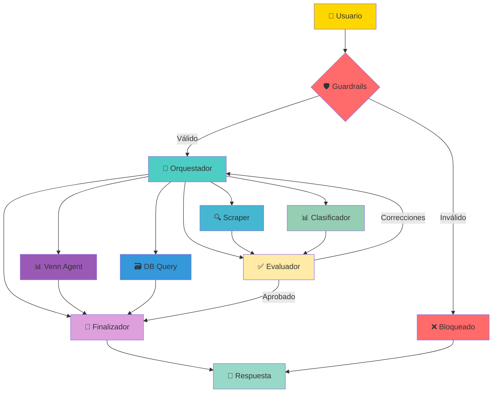

# Sistema Multi-Agente para Organizaciones de la Sociedad Civil en Colombia

## 🎯 Descripción General

Sistema inteligente basado en LangGraph que permite buscar, clasificar y gestionar información sobre organizaciones de la sociedad civil lideradas por mujeres constructoras de paz en Colombia mediante lenguaje natural.

## 🔄 Arquitectura de Agentes



## 🤖 Descripción de Agentes

### 1. Guardrails (GPT-4o-mini)
- **Función**: Valida que las consultas estén relacionadas con organizaciones o diagramas Venn
- **Entrada**: Mensaje del usuario
- **Salida**: Aprobado/Bloqueado con mensaje

### 2. Orquestador (GPT-4o)
- **Función**: Coordina el flujo de trabajo entre agentes
- **Decide**: Qué agente debe ejecutar la siguiente acción
- **Máximo**: 10 iteraciones por consulta

### 3. Scraper (GPT-4o-mini + Tavily)
- **Función**: Busca información en la web
- **Fuentes**: RUES, Cámaras de Comercio, Min. Interior, ONU Mujeres
- **Salida**: Datos crudos de organizaciones

### 4. Clasificador (GPT-4o)
- **Función**: Estructura y normaliza datos
- **Procesa**: Códigos DANE, tipos de organización, ubicaciones
- **Salida**: Datos listos para base de datos

### 5. Evaluador (GPT-4o)
- **Función**: Valida calidad de datos
- **Criterios**: Completitud, precisión, confiabilidad, utilidad
- **Umbral**: Score >= 60 para aprobar

### 6. **DB Query Agent (GPT-4o-mini)** ⭐ NUEVO
- **Función**: Consulta y gestiona organizaciones directamente en la base de datos
- **Acciones disponibles**:
  - `search`: Buscar organizaciones por nombre, ubicación, ámbito, etc.
  - `get`: Obtener detalles de una organización específica
  - `create`: Crear nueva organización
  - `update`: Actualizar organización existente
  - `delete`: Eliminar organización
  - `list`: Listar todas las organizaciones registradas
- **Uso**: Responde preguntas como "¿Tenemos registrada X?", "Lista las organizaciones de Bogotá"

### 7. **Venn Agent (GPT-4o-mini)**
- **Función**: Gestiona variables Venn, proxies, intersecciones y expresiones lógicas desde el chat
- **Acciones disponibles**:
  - `list_venn_variables`: Listar todas las variables (resumen)
  - `get_venn_variable`: Obtener UNA variable con todos sus proxies
  - `create_venn_variable`: Crear nueva variable Venn
  - `update_venn_variable`: Actualizar variable existente
  - `delete_venn_variable`: Eliminar variable
  - `add_venn_proxy`: Agregar proxy a una variable
  - `delete_venn_proxy`: Eliminar proxy de una variable
  - `list_venn_intersections`: Listar intersecciones configuradas
  - `create_venn_intersection`: Crear intersección con expresión lógica
  - `update_venn_intersection`: Modificar intersección existente
  - `delete_venn_intersection`: Eliminar intersección
- **Expresiones Lógicas**: Soporta combinaciones AND/OR con paréntesis
  - Ejemplo: `"ProxyA" OR "ProxyB" OR ("ProxyC" AND "ProxyD")`
- **Uso**: Gestión completa de variables Venn y análisis booleano mediante lenguaje natural

### 8. Finalizador (GPT-4o-mini)
- **Función**: Genera respuesta amigable para el usuario
- **Formato**: Markdown con emojis y estructura clara

## 📡 Endpoints API

### Chat
```
POST /api/chat/send          # Enviar mensaje al sistema
POST /api/chat/validate      # Validar mensaje sin procesar
GET  /api/chat/history/{id}  # Historial de sesión
GET  /api/chat/graph         # Visualización del grafo
GET  /api/chat/status        # Estado del sistema
```

### Scheduler
```
GET  /api/scheduler/status   # Estado del scheduler
POST /api/scheduler/start    # Iniciar scheduler
POST /api/scheduler/stop     # Detener scheduler
POST /api/scheduler/run/{id} # Ejecutar job manualmente
```

## ⏰ Tareas Programadas

| Tarea | Frecuencia | Descripción |
|-------|------------|-------------|
| `weekly_organization_update` | Domingos 2:00 AM | Actualiza todas las organizaciones |
| `daily_health_check` | Diario 6:00 AM | Verifica estado del sistema |
| `monthly_new_organizations` | 1er domingo del mes | Busca nuevas organizaciones |

## 🔧 Configuración

### Variables de Entorno Requeridas
```env
# OpenAI
OPENAI_API_KEY=sk-...

# Tavily (búsqueda web)
TAVILY_API_KEY=tvly-...

# LangSmith (tracing)
LANGSMITH_TRACING=true
LANGSMITH_API_KEY=lsv2_...
LANGSMITH_PROJECT_NAME=organization-agents
LANGSMITH_ENDPOINT=https://eu.api.smith.langchain.com

# Scheduler
ENABLE_SCHEDULER=true
```

## 📊 Modelos Utilizados

| Agente | Modelo | Razón |
|--------|--------|-------|
| Guardrails | GPT-4o-mini | Rápido, bajo costo |
| Orquestador | GPT-4o | Razonamiento complejo |
| Scraper | GPT-4o-mini | Procesamiento rápido |
| Clasificador | GPT-4o | Precisión en clasificación |
| Evaluador | GPT-4o | Análisis de calidad |
| **Venn Agent** | GPT-4o-mini | Parsing de intención y gestión de BD |
| Finalizador | GPT-4o-mini | Generación rápida |

## 🚀 Ejecución

### Desarrollo
```bash
cd infra
docker-compose up -d
```

### Producción
```bash
docker-compose -f docker-compose.yml -f docker-compose.prod.yml up -d
```

## 📝 Ejemplos de Consultas

### 🔍 Búsqueda de Organizaciones
```
✅ "Busca organizaciones de mujeres constructoras de paz en Chocó"
✅ "¿Qué organizaciones de la sociedad civil hay en Antioquia?"
✅ "Información sobre colectivos de mujeres en Meta"
✅ "Lista de organizaciones lideradas por mujeres en Santander"
```

### 📊 Gestión de Variables Venn (via Chat)
```
✅ "Crea una variable llamada Liderazgo Femenino"
✅ "Agrega el proxy 'mujeres líderes' a Liderazgo Femenino"
✅ "Agrega los proxies 'reconciliación', 'víctimas' a Construcción de Paz"
✅ "¿Qué variables Venn tenemos?"
✅ "Elimina el proxy 'ejemplo' de la variable Paz"
✅ "La variable Alcance Regional tiene 45 organizaciones"
✅ "Elimina la variable Prueba"
```

### ❌ Bloqueadas
```
❌ "¿Cómo puedo hackear un sistema?" (Bloqueado)
❌ "Escribe un poema sobre el amor" (Fuera de tema)
```

## 🔒 Guardrails

### Temas Permitidos
- Organizaciones de la sociedad civil
- Colectivos de mujeres constructoras de paz
- Líderes sociales y comunitarias
- Diagramas Venn de variables y proxies
- Geografía de Colombia (departamentos, municipios)

### Patrones Bloqueados
- Intentos de jailbreak
- Solicitudes de contenido malicioso
- Temas no relacionados con organizaciones de mujeres

## 📊 Sistema de Variables Venn

### ¿Qué son las Variables Venn?
Las variables Venn permiten analizar y visualizar datos de organizaciones desde múltiples dimensiones. Cada variable tiene:

1. **Nombre**: Dimensión de análisis (ej: "Liderazgo Femenino")
2. **Descripción**: Explicación de la variable
3. **Proxies**: Términos de búsqueda que identifican la variable en los datos
4. **Tipo de dato**: `list`, `count`, o `boolean`

### Flujo de Trabajo con Venn
1. **Crear variables** desde el chat o la interfaz web
2. **Agregar proxies** para definir qué términos identifican cada variable
3. **Ejecutar scraping** para recopilar datos de organizaciones
4. **Visualizar** el diagrama Venn con las intersecciones

### Ejemplo Completo
```
Usuario: "Crea una variable llamada Construcción de Paz"
Sistema: ✅ Variable Construcción de Paz creada exitosamente

Usuario: "Agrega los proxies 'reconciliación', 'víctimas del conflicto' a Construcción de Paz"
Sistema: ✅ Proxies agregados a la variable Construcción de Paz

Usuario: "Crea una variable llamada Liderazgo Femenino"
Sistema: ✅ Variable Liderazgo Femenino creada exitosamente

Usuario: "Agrega el proxy 'mujeres líderes' a Liderazgo Femenino"
Sistema: ✅ Proxy 'mujeres líderes' agregado

Usuario: "¿Qué variables tenemos?"
Sistema: 📊 Variables Venn existentes:
         - Construcción de Paz (proxies: reconciliación, víctimas del conflicto)
         - Liderazgo Femenino (proxies: mujeres líderes)
```

## 📈 Monitoreo

### LangSmith Dashboard
- Traces de todas las ejecuciones
- Métricas de latencia
- Errores y feedback

### Health Check
- Estado de base de datos
- Disponibilidad de APIs
- Estado de agentes
